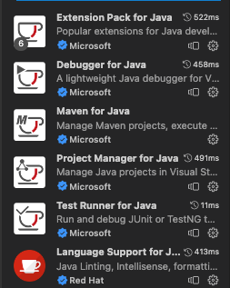

# Tokyo-Tech-Research-Project

東工大 学部 3 年次 研究プロジェクト(小野研)

Tokyo Institute of Technology Undergraduate 3rd year Research Project (ONO Lab)

Genetic Algorithm for non-linear optimization

## 実行環境 (Running Environment)

研究プロジェクトではEclipse を用いることが推奨されている。

だがEclipse のショートカットと Visual Studio Code のショートカットが異なっており開発体験が悪いため、Visual Studio Code を用いることにした。

以下では、Visual Studio Code を用いた開発環境の構築方法を記す。

まず小野先生も指摘していたが、Visual Studio Code では複数プロジェクトを同時に開くことができない。（原則）
そのため、ResearchProject01, ResearchProject02, ... のようにプロジェクトごとに別々の Visual Studio Code ワークスペースで開いて開発を行う。

上記のように、1-Java Project, 1-VSCode Workspace という構成にすれば、簡単に実行環境を用意することが可能である。

私が導入した Java 関連のプラグインは以下の通りである。



これらの拡張機能(プラグイン)を導入すれば、main 関数の横に`Run|Debug`のような表示が出現する。
これを用いれば、簡単に実行環境を用意することができる。

また、デバッグ機能も特別な設定をせずに用いることができる。

かなり強力なデバッガであるため、積極的に持ちることを推奨する。

## ディレクトリ構成 (Directory Structure)

```
tokyo-tech-research-project/
├── README.md
├── ResearchProject01
│   ├── bin
│   │   ├── crfmnes
│   │   ├── jgoal
│   │   ├── jssf
│   │   ├── report01
│   │   ├── report02
│   │   ├── report03
│   │   ├── report04
│   │   ├── report05
│   │   ├── report06
│   │   └── samples
│   └── src
│       ├── crfmnes
│       ├── jgoal
│       ├── jssf
│       ├── report01
│       ├── report02
│       ├── report03
│       ├── report04
│       ├── report05
│       ├── report06
│       └── samples
├── ResearchProject02
│   ├── bin
│   │   └── rexjgg
│   └── src
│       └── rexjgg
├── ResearchProjectLensDesign
│   ├── 3lens-F3_0-f100-w19.txt
│   ├── GaussLens.txt
│   ├── NoEDGlass.glass
│   ├── bin
│   │   └── lensDesignProblem
│   ├── gauss-mod.glass
│   └── src
│       └── lensDesignProblem
└── public
    └── vscode-extensions.png
```

- ResearchProject01

  初回の講義で配布される講義資料

  遺伝アルゴリズムを用いた最適化問題の解法を実感するためのコードがある。
  詳しい仕組みなどは、一緒に配布される論文などを読むことわかる。

- ResearchProject02

  第２回, 第 3 回の講義で用いるコード。

  ここで REX/JGG を自前で実装してみることが要求される。

  実装自体は、配布される手順書通りに行えば問題ないが、１点注意が必要である。
  それは、私がハマった点でもあるのだが、Java の参照型についての挙動である。

  REX/JGG を実装するにあたって、Sort をする機会がある。そこで java.util.ArrayList を用いることを検討すると思われるが、ここにはまりどころがある。

  それは、shallow copy, deep copy についてである。

  [参考記事](https://qiita.com/KuwaK/items/255de3454ea3327211d3)

  [ArrayList deepcopy](https://codechacha.com/ja/java-arraylist-deep-copy/)

## Java コンパイル

[Visual Studio Code Run and Debug Configurations](https://code.visualstudio.com/docs/java/java-debugging#_configuration-options)

### `java.lang.ClassNotFoundException`

このエラーは、`bin/`ディレクトリに`.class`ファイルが生成されていないことで発生するエラーである。

以下のようすることで、エラーが解決できた。

```zsh
cd ResearchProjectLensDesign/src
javac lensDesignProblem/RexJgg.java -d ../bin/
```

`-d ../bin/`により、bin/ に class ファイルを生成することができる。

このオプションを渡さずに`javac`コマンドを安易に叩くと、src/ に class ファイルが生成されてしまう。
また、このままでは Visual Studio Code の Debug の際に十分な情報が得られない。デバッグ情報を付加するには、以下のようにする

```zsh
javac lensDesignProblem/RexJgg.java -g -d ../bin/
```

詳しい Java Compile Optionについては、以下を参照

[javac - Java](https://docs.oracle.com/javase/jp/1.5.0/tooldocs/windows/javac.html#:~:text=javac%20%E3%81%A7%E3%81%AF%E5%87%BA%E5%8A%9B%E5%85%88%E3%83%87%E3%82%A3%E3%83%AC%E3%82%AF%E3%83%88%E3%83%AA,%E3%82%AF%E3%83%A9%E3%82%B9%E3%83%95%E3%82%A1%E3%82%A4%E3%83%AB%E3%82%92%E7%BD%AE%E3%81%8D%E3%81%BE%E3%81%99%E3%80%82)


主なオプション

- `-g`

  局所変数を含むすべてのデバッグ情報を生成します。デフォルトでは、行番号およびソースファイル情報だけが生成されます。

- `-d directory`

  クラスファイルの出力先ディレクトリを設定します。出力先ディレクトリはあらかじめ用意されている必要があります。`javac` では出力先ディレクトリは作成されません。クラスがパッケージの一部である場合、`javac` は、必要に応じてディレクトリを作成し、パッケージ名を反映したサブディレクトリにクラスファイルを置きます。たとえば、-d c:\myclasses と指定した場合、クラスの名前が com.mypackage.MyClass であると、クラスファイルは c:\myclasses\com\mypackage\MyClass.class になります。
  -d が指定されていない場合、javac は、ソースファイルと同じディレクトリにクラスファイルを置きます。

  注: -d で指定したディレクトリはユーザクラスパスに自動的には追加されません。

### Java の package と import について

[参考記事: いまさら聞けないjavaのpackageとimport](https://yamshing.hatenablog.com/entry/2016/09/14/211521)


## Java Utils

### `java.util.ArrayList`

`ArrayList`の要素が参照型の場合、意図せぬ参照が発生することがある。要素の型に`.clone()`メソッドがある場合は、それを用いることで、意図せぬ参照を防ぐことができる。

```java
List<Student> deepCopyList = new ArrayList<>();
for (Student student : origList) {
    deepCopyList.add((Student) student.clone());
}
```
のように、要素１つ１つに対して`.clone()`を用いる方法が最も確実である。


[参考Link](https://codechacha.com/ja/java-arraylist-deep-copy/)に詳しい挙動があるが、shallow copyになっていると予期せぬ変更が行われる。デバッガを用いないと特定が困難なものが多いため、注意が必要である。

### `compareTo` method

[参考 記事](https://camp.trainocate.co.jp/magazine/java-compareto-date-text/)


### `java.random`

[参考 oracle](https://docs.oracle.com/javase/jp/6/api/java/util/Random.html)

今回のプロジェクトでは、一様乱数 (random.nextDouble()) や、正規分布乱数 (random.nextGaussian()) を用いた。


